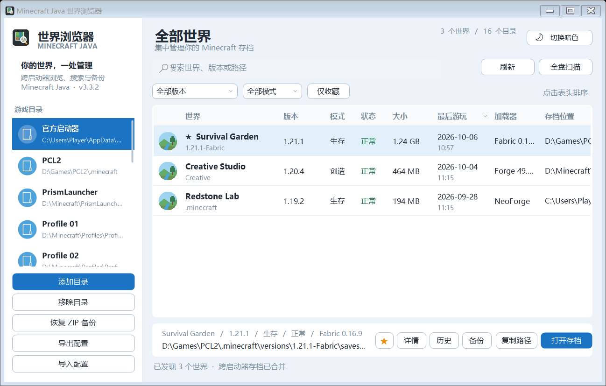
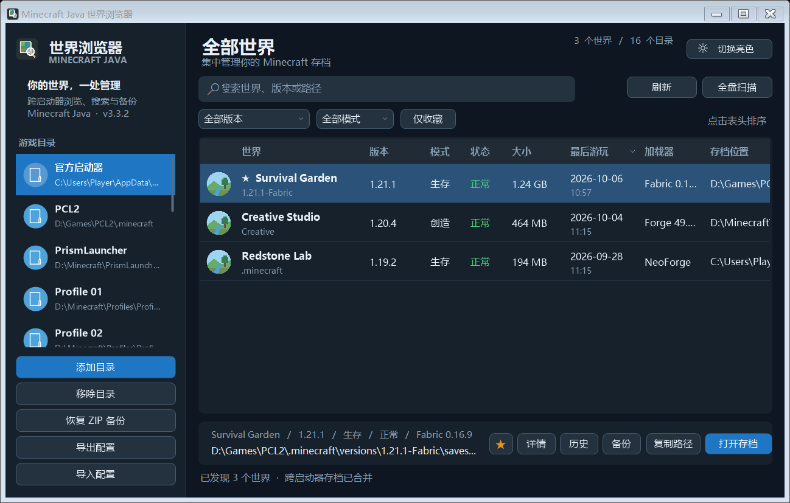
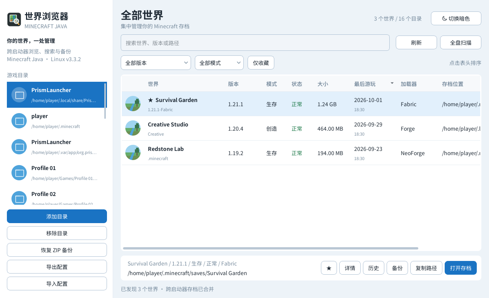
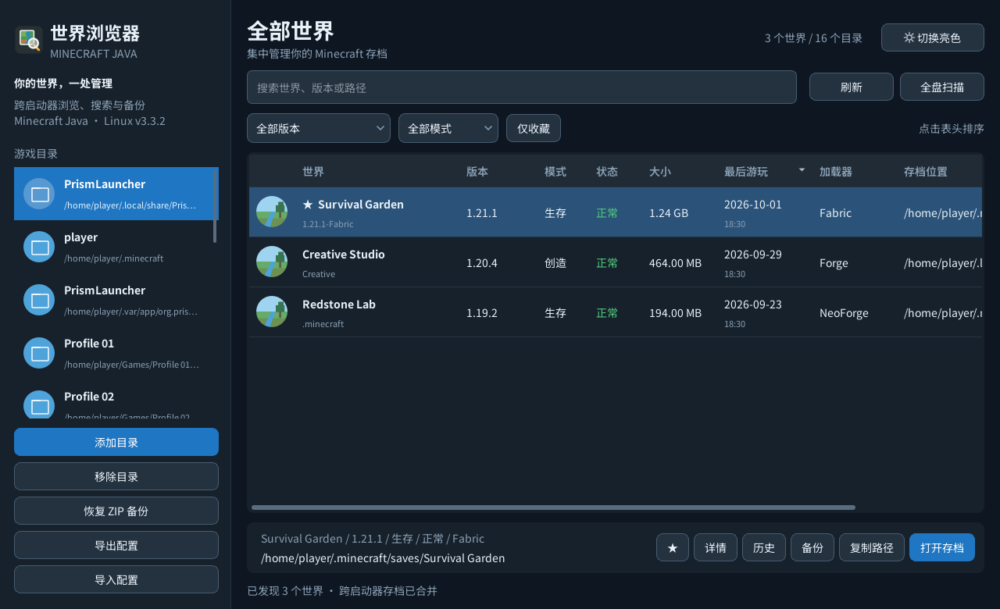

<div align="center">
  
  <h1>Minecraft Java 世界浏览器</h1>
  <p>在 Windows 和 Linux 上，集中查找、浏览、筛选、备份和恢复散落在不同启动器与实例中的 Minecraft Java 世界。</p>
  <p>
    <a href="https://github.com/Aaron88915/MinecraftWorldBrowser/releases/latest"><strong>下载最新版</strong></a>
    ·
    <a href="CHANGELOG.md">查看更新记录</a>
  </p>
</div>

## 功能

- 自动扫描常见启动器、`.minecraft`、实例与整合包目录中的世界
- 兼容 PCL2、HMCL、官方启动器、Prism Launcher、MultiMC、CurseForge、Modrinth、ATLauncher 和 GDLauncher 等常见目录结构
- 从 `level.dat` 读取世界名称、Minecraft 版本、游戏模式、难度、最后游玩时间等信息
- 显示加载器、存档状态、存档大小和真实路径
- 按名称、版本或路径搜索，并按版本、模式和收藏状态筛选
- 支持表头排序、收藏、标签、备注和备份历史
- 创建 ZIP 备份，并记录原存档位置
- 恢复时可返回原位置；目标已存在时可选择覆盖或创建新存档
- 自动备份、配置导入导出、拖放目录、刷新与全盘扫描
- Telegram Desktop 风格的亮色与暗色界面，支持平面按钮反馈、圆形图标、双行信息、平滑滚动和实时调整列宽

## 下载

当前版本为 **v3.3.2**，Windows 和 Linux 使用同一版本号。前往 [Releases](https://github.com/Aaron88915/MinecraftWorldBrowser/releases/tag/v3.3.2)，或直接选择适合你的文件：

| 系统 / 用途 | 下载 | 使用方式 |
| --- | --- | --- |
| Windows 10 / 11 | [单文件 EXE](https://github.com/Aaron88915/MinecraftWorldBrowser/releases/download/v3.3.2/MinecraftWorldBrowser-v3.3.2.exe) | 双击运行，无需安装 |
| Kali / Debian / Ubuntu，x86_64 | [Linux 一键安装包](https://github.com/Aaron88915/MinecraftWorldBrowser/releases/download/v3.3.2/MinecraftWorldBrowser-v3.3.2-linux-x86_64-install.run) | 自动补齐依赖，创建桌面与菜单图标 |
| Linux，x86_64 | [解压启动包](https://github.com/Aaron88915/MinecraftWorldBrowser/releases/download/v3.3.2/MinecraftWorldBrowser-v3.3.2-linux-x86_64.tar.gz) | 解压后运行 `./launch.sh` |
| Linux 开发与源码运行 | [源码启动包](https://github.com/Aaron88915/MinecraftWorldBrowser/releases/download/v3.3.2/MinecraftWorldBrowser-v3.3.2-linux-source.tar.gz) | 解压后运行 `sh setup.sh`，再运行 `sh launch.sh` |

Windows 版需要 .NET Framework 4.8。Linux x86_64 安装包与解压启动包包含 Python、Qt 和中文字体，需要使用 glibc 的图形桌面环境；不适用于 ARM64 或 Alpine/musl。Release 同时提供 Linux 下载文件的 `.sha256` 校验文件。

### Linux版本 一键安装

下载 `.run` 文件，在文件所在目录执行：

```sh
sh MinecraftWorldBrowser-v3.3.2-linux-x86_64-install.run
```

使用普通用户运行，不要在命令前加 `sudo`。缺少系统依赖时，安装器会联网安装并提示输入 sudo 密码，包括 Qt 所需的 `libxcb-cursor0`。

安装完成后，双击桌面上的「Minecraft Java 世界浏览器」即可启动。程序安装在 `~/.local/share/minecraft-world-browser/app/`，下载文件可以删除；重复安装会保留配置、标签和备份记录。也可以解压启动包后双击「一键安装.desktop」，按桌面环境提示允许启动。

Linux 的依赖排查、源码运行、配置迁移和安装选项见 [Linux 版说明](linux/README.md)。

> 此项目不是 Mojang Studios 或 Microsoft 的官方产品。Minecraft 是 Microsoft 旗下商标。

## 界面预览

Telegram Desktop 风格的亮色与暗色主题，按钮与筛选器带清晰边界，世界列表只保留横向分隔线。以下截图使用示例存档：

| 平台 | 亮色主题 | 暗色主题 |
| --- | --- | --- |
| Windows |  |  |
| Linux |  |  |

## 使用方法

1. Windows 双击 EXE；Linux 点击安装后的桌面图标，或在解压目录运行 `./launch.sh`。
2. 首次启动时可添加一个 `.minecraft`、游戏实例或启动器目录；跳过也可以直接进入。
3. 点击右上角“全盘扫描”，自动发现电脑中的其他 Minecraft Java 目录。
4. 使用搜索框、版本/模式筛选器、收藏或表头排序找到目标世界。
5. 双击世界或点击“打开存档”可打开真实目录；“详情”可查看并编辑标签与备注。
6. 执行版本升级、安装模组或修改地图前，建议先点击“备份”。

全盘扫描耗时取决于磁盘和目录数量。扫描只读取文件；只有在你主动执行备份恢复、覆盖或配置写入时，程序才会修改文件。

## 识别范围

程序会识别以下常见结构，并递归发现启动器实例：

```text
.minecraft/saves/<世界>
.minecraft/versions/<版本>/saves/<世界>
instances/<实例>/.minecraft/saves/<世界>
profiles/<实例>/saves/<世界>
modpacks/<实例>/saves/<世界>
packs/<实例>/saves/<世界>
```

未被自动识别的目录可以通过“添加目录”手动加入。

## 本地数据

Windows 配置与备份记录保存在：

```text
%LOCALAPPDATA%\PCL2WorldBrowser
```

| 文件或目录 | 用途 |
| --- | --- |
| `roots.txt` | 已添加和自动发现的游戏目录 |
| `world-metadata.txt` | 收藏、标签、备注和自动备份设置 |
| `backup-history.txt` | 备份历史及原始存档位置 |
| `theme.txt` | 亮色/暗色主题设置 |
| `AutomaticBackups` | 自动备份生成的 ZIP 文件 |

世界扫描缓存和大小缓存只保存在内存中，退出程序后会清除。

Linux 配置、元数据与备份历史保存在 `~/.local/share/minecraft-world-browser/settings.json`，自动备份位于同目录下的 `AutomaticBackups/`；设置 `XDG_DATA_HOME` 时使用该目录。Linux 支持导入 Windows 的 `.mwconfig` 配置与恢复 ZIP 备份，迁移后需要添加 Linux 上的实际存档路径。

## 从源码运行

```powershell
powershell.exe -NoProfile -ExecutionPolicy Bypass -File .\MinecraftWorldBrowser.ps1
```

## 自检

```powershell
powershell.exe -NoProfile -ExecutionPolicy Bypass -File .\MinecraftWorldBrowser.ps1 -SelfTest
```

自检覆盖 NBT 读取、启动器目录发现、备份恢复安全、主题与布局、平滑滚动、列宽调整、收藏位置保持、存档大小回填等关键行为。

## 构建 EXE

项目使用 Windows 自带的 .NET Framework C# 编译器，不要求安装 Visual Studio 或 .NET SDK：

```powershell
powershell.exe -NoProfile -ExecutionPolicy Bypass -File .\Build-Exe.ps1 `
  -OutputName MinecraftWorldBrowser.exe
```

构建脚本会生成多尺寸应用图标、提取嵌入式 C# 源码并输出单文件 EXE。

界面验证与截图（包含源码自检、EXE 冒烟测试、亮暗主题预览和实际窗口截图）：

```powershell
powershell.exe -NoProfile -ExecutionPolicy Bypass -File .\tools\Verify-Ui.ps1 `
  -Executable MinecraftWorldBrowser.exe
```

截图保存到 `build/telegram-ui/`，实际屏幕截图时预览窗口会短暂显示；预览使用示例存档，不执行扫描或保存配置。传入 `-BaselineExecutable MinecraftWorldBrowser-v3.2.10.exe` 可以同时生成旧版预览进行对比。

## 项目文件

```text
MinecraftWorldBrowser.ps1    主程序与自检
Build-Exe.ps1                离线 EXE 构建脚本
启动世界浏览器.bat            自动运行目录中最新版本
assets/                      应用图标
linux/                       Linux Qt 程序、安装器、测试与打包工具
.github/workflows/linux.yml  Ubuntu 22.04 / 24.04 构建、界面与安装检查
CHANGELOG.md                 完整版本记录
```

## 反馈

发现无法识别的启动器目录、界面显示问题或备份异常时，请在 [Issues](https://github.com/Aaron88915/MinecraftWorldBrowser/issues) 提交问题，并附上启动器名称、目录结构和程序版本。请不要上传包含个人信息的完整路径或私人存档。
